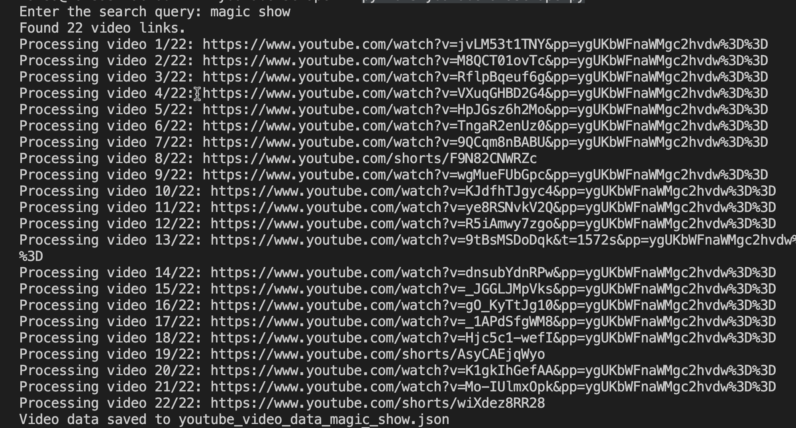

# YouTube Scraper

This project is a Python-based scraper that extracts information from YouTube videos, including regular videos and YouTube Shorts. It uses Selenium to handle dynamic content and collect metadata such as video titles, likes, views, and more.

## Features

- Scrapes both **regular YouTube videos** and **YouTube Shorts**.
- Extracts metadata such as:
  - **Type**
  - **Title**
  - **Views**
  - **Channel**
  - **Video Links**
- Handles dynamic content loading using Selenium.
- Automatically detects and processes Shorts videos differently from regular videos.
- Saves collected data to a JSON file for easy use.

## Prerequisites

1. **Python**: Ensure Python 3.8 or higher is installed.
2. **Google Chrome**: Install the latest version of Google Chrome.
3. **ChromeDriver**: Download and install ChromeDriver that matches your Chrome version. [Get ChromeDriver here](https://chromedriver.chromium.org/downloads).
4. **Python Packages**:
   - Install required dependencies:
     ```bash
     pip install selenium
     ```

## Installation

1. Clone the repository:
   ```bash
   git clone https://github.com/Hafsa-Begum/youtube-scraper.git
   cd youtube-scraper
   ```
2. Install dependencies:
    ```bash
    pip install -r requirements.txt
    ```
3. Run code in terminal:
    ```bash
    python3 youtubeDataScrape.py
    ```
## Output

1. Output in terminal:
    

2. Generated JSON File (youtube_video_data_your_search_text)